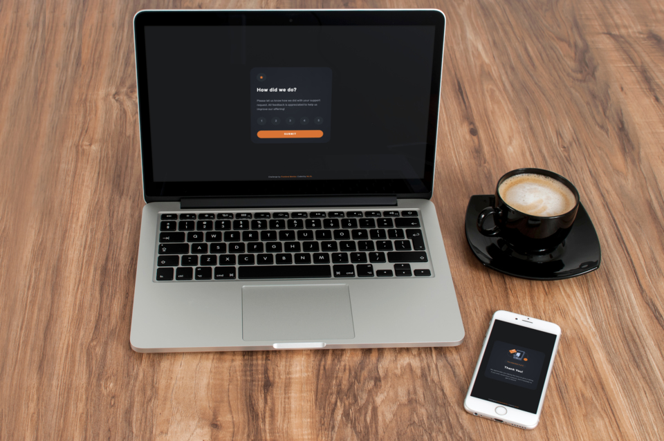
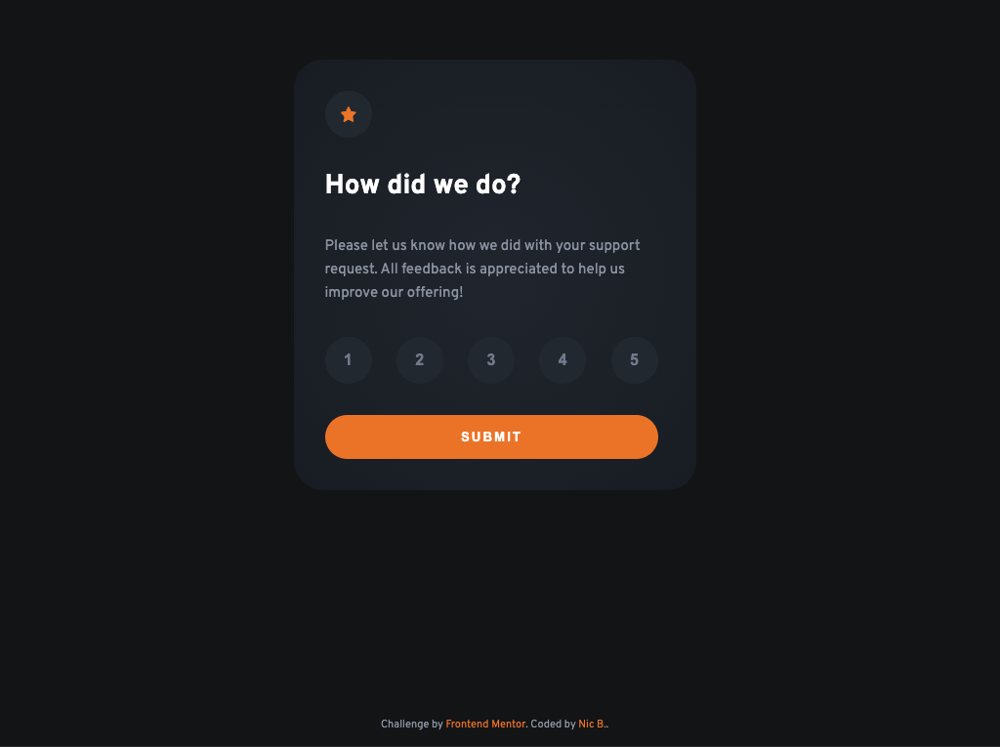

# Frontend Mentor - Interactive rating component



## Contents

- [Overview]
  - [The challenge]

## Overview

Thanks for checking out my solution to the [Frontend Mentor](https://www.frontendmentor.io) Interactive rating component. I decided to use [SvelteKit](https://kit.svelte.dev/) to do this project. This choice was mainly to better learn the framework. You can find a live version on the project here:

### The challenge

Users should be able to:

- View the optimal layout for the app depending on their device's screen size
- See hover states for all interactive elements on the page
- Select and submit a number rating
- See the "Thank you" card state after submitting a rating

### Screenshot



### Links

- Solution URL: [Add solution URL here](https://github.com/NicBritz/drk-lgt-InteractiveRatingComponent)
- Live Site URL: [Add live site URL here](https://your-live-site-url.com)

### Built with

- HTML5
- CSS custom properties
- Flexbox
- Javascript es6
- Mobile-first workflow
- [SvelteKit](https://kit.svelte.dev/)

## Developing

Once you've cloned the repo `npm install` (or `pnpm install` or `yarn`), start a development server:

```bash
npm run dev

# or start the server and open the app in a new browser tab
npm run dev -- --open
```

## Building

To create a production version of your app:

```bash
npm run build
```

You can preview the production build with `npm run preview`.

> To deploy your app, you may need to install an [adapter](https://kit.svelte.dev/docs/adapters) for your target environment.

## Author

##### Nic Britz

- Website - [Dark-Light](https://www.dark-light.tech/)
- Frontend Mentor - [@NicBritz](https://www.frontendmentor.io/profile/NicBritz)
- Twitter - [@n_britz](https://twitter.com/n_britz)
